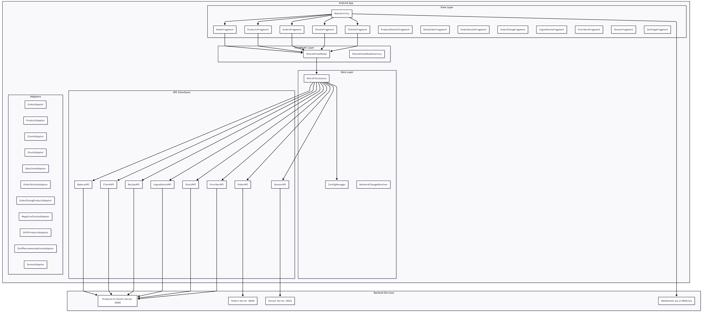
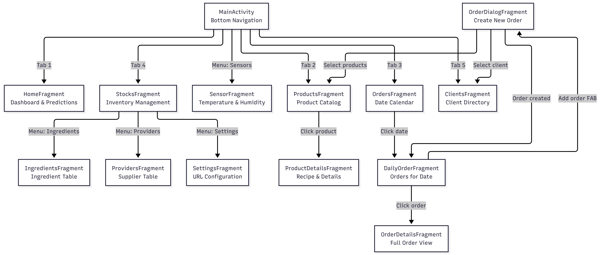
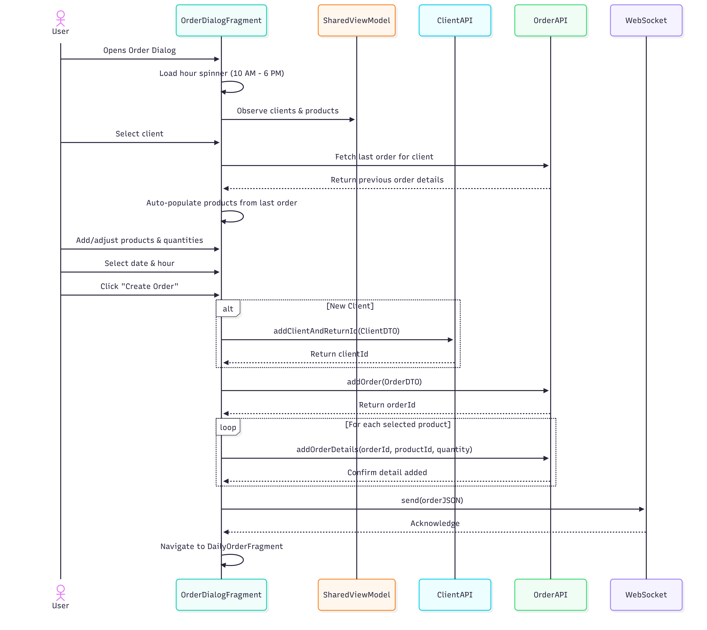
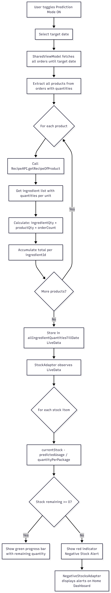
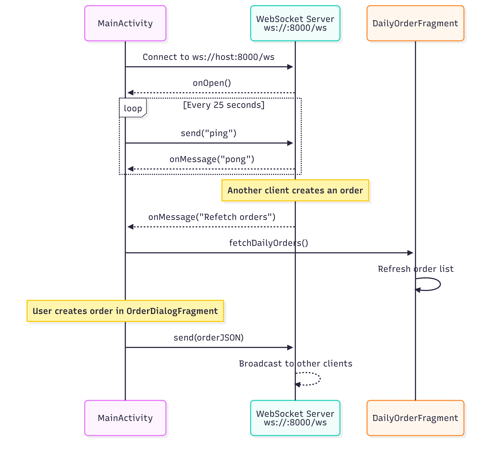
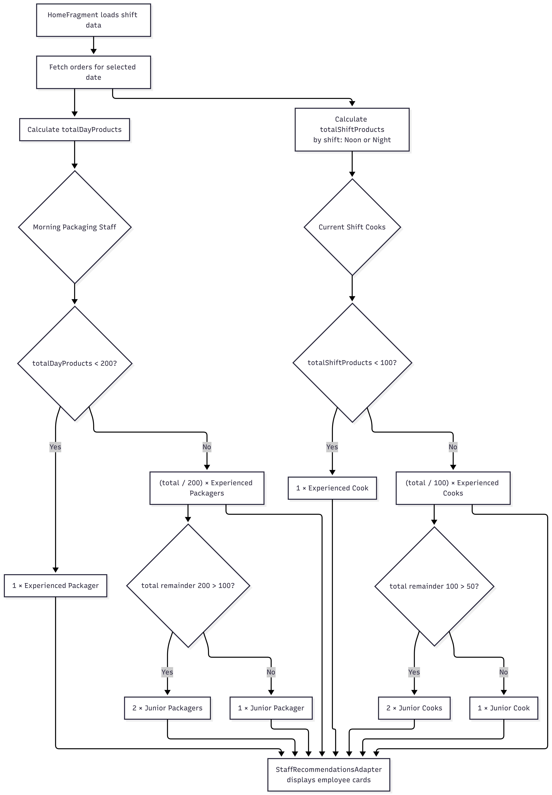
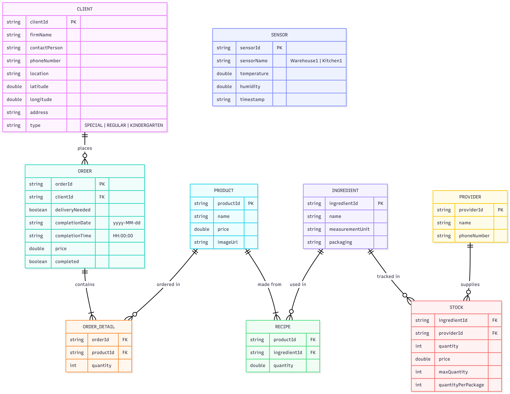
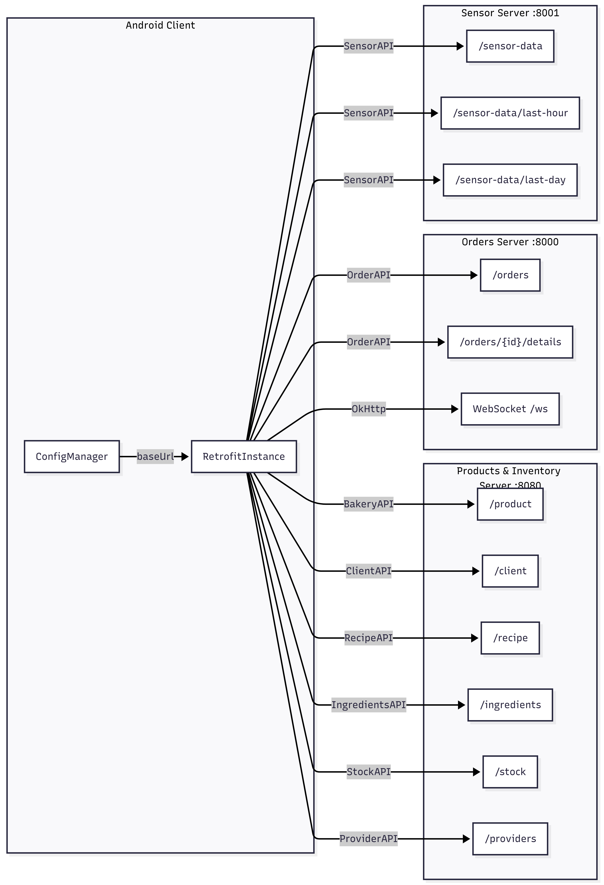

# Pastry Central

A full-featured Android bakery management application built as a diploma project. Manages the complete bakery workflow — products, recipes, clients, orders, inventory, and staffing — with real-time synchronization and predictive analytics.

---

## Key Highlights

- **MVVM Architecture** with SharedViewModel, LiveData, and Fragment-based UI
- **Real-time sync** via WebSocket (OkHttp3) for live order updates across devices
- **Stock prediction engine** that forecasts ingredient consumption based on pending orders and recipes
- **Staff recommendation algorithm** that calculates required cooks and packagers per shift
- **RESTful API integration** with Retrofit2 across 3 backend services (8 API interfaces)
- **IoT sensor monitoring** for bakery environment (temperature/humidity)
- **Modern Android stack**: Kotlin, Coroutines, Material Design, Glide, Shimmer

---

## Architecture



<!-- Diagram source: docs/mermaid_code.md → "1. Architecture Overview" -->

The app follows a single-Activity MVVM pattern. `MainActivity` hosts a `BottomNavigationView` routing to 5 primary fragments. A shared `SharedViewModel` manages cross-fragment state via LiveData. All data flows through Retrofit API interfaces to a multi-service backend.

| Layer     | Components                                                      |
| --------- | --------------------------------------------------------------- |
| View      | 14 Fragments, 11 RecyclerView Adapters, Dialogs                 |
| ViewModel | SharedViewModel with LiveData observables                       |
| Data      | 8 Retrofit API interfaces, ConfigManager, WebSocket             |
| Backend   | Products server `:8080`, Orders server `:8000`, Sensors `:8001` |

---

## Navigation



<!-- Diagram source: docs/mermaid_code.md → "2. Navigation Flow" -->

| Tab      | Fragment           | Purpose                                                                             |
| -------- | ------------------ | ----------------------------------------------------------------------------------- |
| Home     | `HomeFragment`     | Dashboard: shift management, staff recommendations, stock predictions, PDF printing |
| Products | `ProductsFragment` | Product catalog with images, search, CRUD. Tap for recipe details                   |
| Orders   | `OrdersFragment`   | 14-day calendar, browse by date, create orders with auto-populate                   |
| Stocks   | `StocksFragment`   | Inventory tracking with prediction mode toggle                                      |
| Clients  | `ClientsFragment`  | Client directory with type categorization, Waze integration, contact lookup         |

---

## Features

### Order Management



<!-- Diagram source: docs/mermaid_code.md → "3. Order Creation Flow" -->

- Create orders via dialog: select client, choose products with quantities, pick date and hour (10 AM - 6 PM)
- Auto-populates product list from the client's last order
- Supports new client creation inline during order creation
- Real-time WebSocket notification to all connected devices on new order
- Toggle order completion, filter by status, search by client/price

### Stock Prediction System



<!-- Diagram source: docs/mermaid_code.md → "4. Stock Prediction Flow" -->

A prediction engine that calculates ingredient consumption until a target date:

1. Aggregates all pending orders until the selected date
2. Looks up each product's recipe (ingredient quantities)
3. Computes total ingredient demand across all orders
4. Compares against current stock levels
5. Flags negative stocks with red alerts on the dashboard

### Real-Time WebSocket



<!-- Diagram source: docs/mermaid_code.md → "5. WebSocket Real-Time Communication" -->

- Persistent WebSocket connection (`ws://:8000/ws`) established on app launch
- Heartbeat ping/pong every 25 seconds
- Server pushes `"Refetch orders"` to trigger automatic order list refresh
- New order creation broadcasts to all connected clients

### Staff Recommendation Engine



<!-- Diagram source: docs/mermaid_code.md → "6. Staff Recommendation Engine" -->

Algorithm-driven staffing based on order volume:

| Role               | Threshold             | Output                           |
| ------------------ | --------------------- | -------------------------------- |
| Packager (morning) | < 200 products/day    | 1 Experienced                    |
| Packager (morning) | >= 200 products/day   | (total/200) Experienced + Junior |
| Cook (shift)       | < 100 products/shift  | 1 Experienced                    |
| Cook (shift)       | >= 100 products/shift | (total/100) Experienced + Junior |

### Additional Features

- **Product catalog** with image loading (Glide), circular thumbnails, shimmer loading
- **Recipe management** linking products to ingredients with quantities
- **Client management** with 3 types (Special, Regular, Kindergarten), GPS coordinates, Waze navigation
- **Ingredient & provider tables** for supply chain tracking
- **IoT sensor monitoring** (Warehouse, Kitchen) — temperature and humidity
- **Configurable network** — switch between home/mobile API endpoints via settings

---

## Data Model



<!-- Diagram source: docs/mermaid_code.md → "7. Data Model Relationships" -->

Core entities: **Client**, **Order**, **OrderDetail**, **Product**, **Recipe**, **Ingredient**, **Stock**, **Provider**, **Sensor**

---

## API Architecture



<!-- Diagram source: docs/mermaid_code.md → "8. API Architecture" -->

| Service              | Port | APIs                                                                   |
| -------------------- | ---- | ---------------------------------------------------------------------- |
| Products & Inventory | 8080 | BakeryAPI, ClientAPI, RecipeAPI, IngredientsAPI, StockAPI, ProviderAPI |
| Orders               | 8000 | OrderAPI + WebSocket                                                   |
| Sensors              | 8001 | SensorAPI                                                              |

---

## Tech Stack

| Category      | Technologies                                                |
| ------------- | ----------------------------------------------------------- |
| Language      | Kotlin 1.9.0                                                |
| Architecture  | MVVM, LiveData, ViewModel, Coroutines                       |
| Networking    | Retrofit2 2.9.0, OkHttp3 4.9.1, Gson 2.9.0                  |
| UI            | Material Design 1.10.0, RecyclerView, ConstraintLayout      |
| Image Loading | Glide 4.12.0, CircleImageView 3.1.0                         |
| UX Polish     | Facebook Shimmer 0.5.0, SwipeRefreshLayout, GraphView 4.2.2 |
| Real-time     | OkHttp3 WebSocket                                           |
| Config        | AndroidX Preferences KTX 1.2.1                              |
| Min SDK       | 24 (Android 7.0)                                            |
| Target SDK    | 34 (Android 14)                                             |
| Build         | Gradle 8.5.0, AGP 8.5.0                                     |

---

## Project Structure

```
com.example.myapplication/
├── MainActivity.kt              # Single activity, bottom nav, WebSocket
├── fragments/     (14)          # All UI screens
├── adapters/      (11)          # RecyclerView adapters
├── api/           (8)           # Retrofit API interfaces
├── config/        (3)           # Network config, Retrofit builder
├── shared/        (2)           # SharedViewModel + Factory
├── dtos/          (7)           # Data transfer objects
└── dialog/        (1)           # Image preview dialog
```

---

## Documentation

See [docs/documentation.md](docs/documentation.md) for comprehensive technical documentation including:

- Detailed feature breakdowns with algorithm descriptions
- Complete API endpoint reference
- Data model specifications
- Package structure with class descriptions

Diagram source code (Mermaid) is available in [docs/mermaid_code.md](docs/mermaid_code.md).
