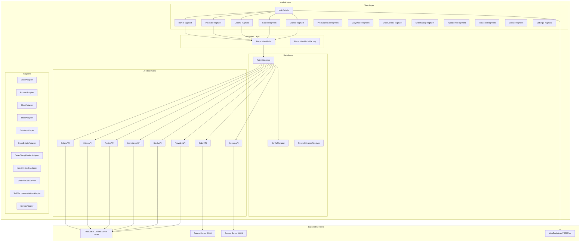
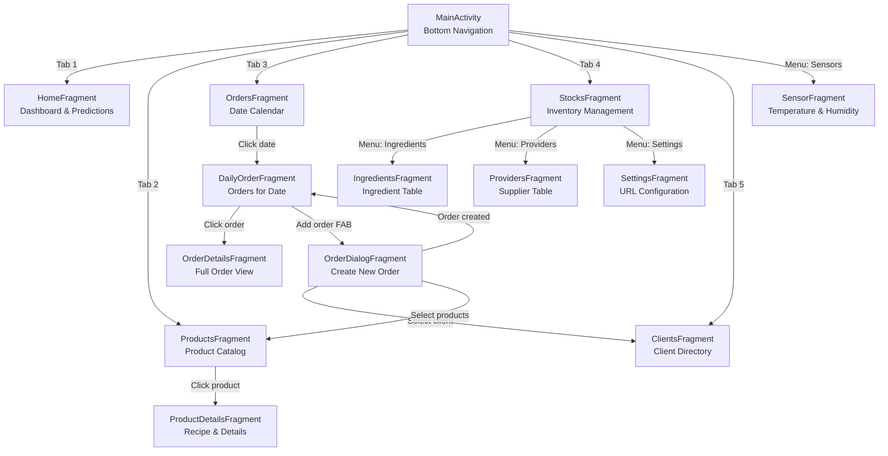
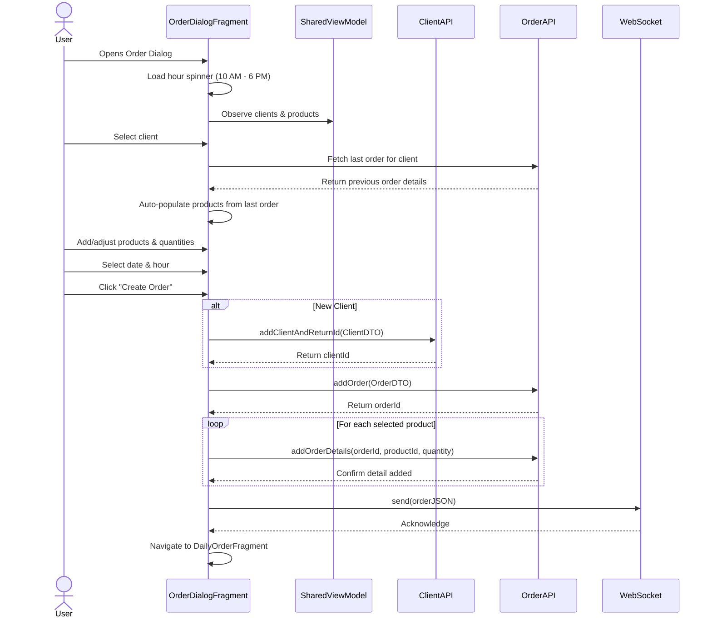
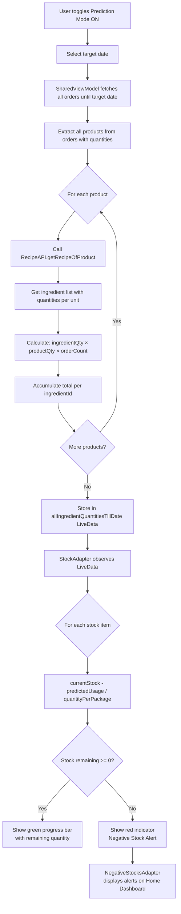
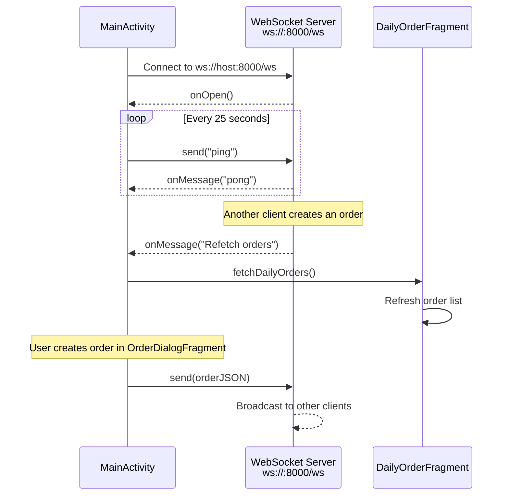
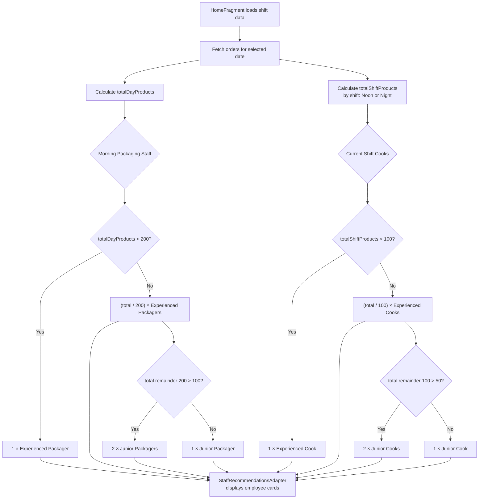
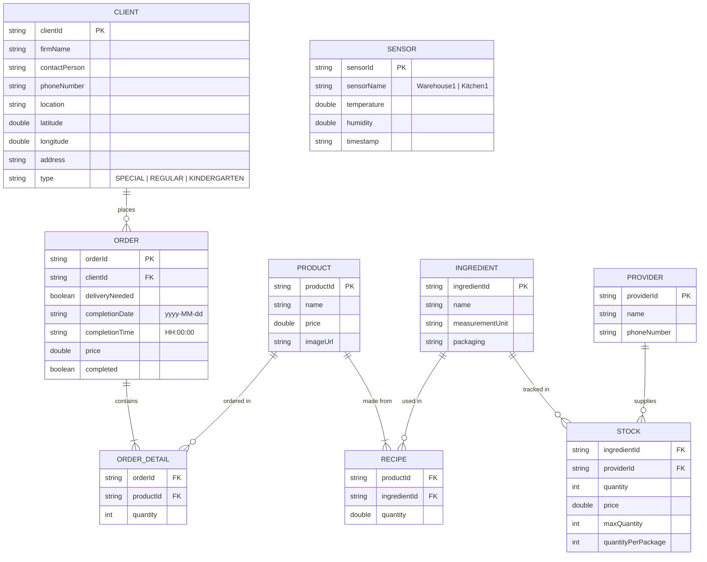
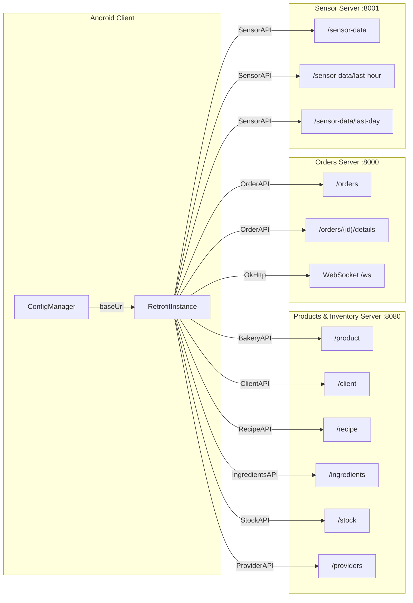

# Mermaid Diagram Code

Use [Mermaid Live Editor](https://mermaid.live) to render each diagram, then export as PNG and place in `docs/`.

---

## 1. Architecture Overview (`architecture.png`)

---

## 2. Navigation Flow (`navigation_flow.png`)

---

## 3. Order Creation Flow (`order_creation_flow.png`)

---

## 4. Stock Prediction Flow (`stock_prediction_flow.png`)

---

## 5. WebSocket Real-Time Communication (`websocket_flow.png`)

---

## 6. Staff Recommendation Engine (`staff_recommendation.png`)

---

## 7. Data Model Relationships (`data_model.png`)

---

## 8. API Architecture (`api_architecture.png`)

